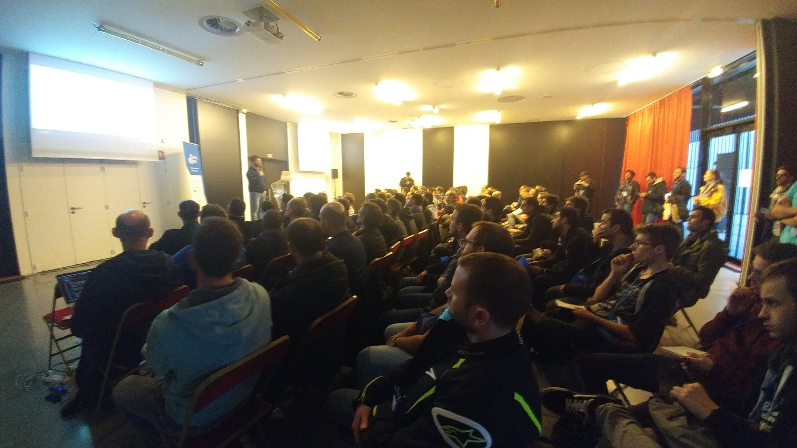

# Résumé de la conférence Codeurs En Seine 2018 "Découvrir par l’exemple : Microservices et Event Sourcing avec Kafka et Kubernetes"

## Cartouche d'identification

 - Manifestation : Codeurs En Seine 2018
 - Lieu : Kindarena - Palais des sports de Rouen - 40 rue de Lillebonne - 76000 ROUEN, FRANCE
 - Conférence : Découvrir par l’exemple : Microservices et Event Sourcing avec Kafka et Kubernetes
 - Horaire de la conférence : 15h40
 - Durée de la conférence : 50 minutes
 - Conférencier(s) :
   - Tugdual Grall (https://www.linkedin.com/in/tugdualgrall/, [@tgrall](https://github.com/tgrall))
 - Audience : 110 personnes
 - Auteur du billet : Maxime CARPENTIER - [@MaximeCar](https://github.com/MaximeCar)
 - Mots-clés
   - Kubernetes
   - Microservices
   - Apache Kafka
   - Event Sourcing
   - Data Capture
   - Container
   - Docker
   - Fiabilité
   - Analyse UX
   - OpenShift
 - Illustration : 
   - Image de la conférence, Photo by Maxime Carpentier

## Support
 - Lien vers le support (diapos) présenté en conférence
 - Nombre de diapos du support : Inconnu
 - Plan du support :
  - Introduction
  - Event Drivent Architecture & Microservices
  - Containers, Kubernetes, & OpenShift
  - Apache Kafka & Streaming
  - Use Cases
    - The Stream Is The System of Record
    - Using CDC to add Microservices to Monolith
    - Event Sourcing: Healthcare, Retail

## Résumé
Dans cette conférence, Tugdual Grall nous présente la mise en place de microservices à l’aide d'Apache Kafka pour réaliser de l’event sourcing et de Kubernetes pour les déployer. Cet exemple servira de fil rouge pour la présentation.

Kafka, produit Apache, est un système de messaging (publish/subscribe) permettant de traiter des événements data streaming. L’intérêt de Kafka réside en sa tolérance aux pannes et en son système de stockage des logs reçus à travers des brokers divisés en plusieurs partitions. Kafka est alors capable d'envoyer des messages et de lire ceux reçus. Ainsi, de multiples clients vont pouvoir écrire ou lire simultanément sur les partitions. Enfin Kafka journalise et réplique les données entre brokers afin d'assurer une persistance.

Kubernetes est un orchestrateur de conteneurs. Cet outil est aujourd'hui un pilier dans le monde du déploiement d'applications. Cet orchestrateur est capable de déployer, de monter et de baisser en charge, d'interconnecter et de monitorer des conteneurs (et donc nos applications) à la volée.

Dès  que le conférencier eut terminé de présenter les capacités des différentes technologies, nous les avons mises en applications par l'exemple.
Nous nous plaçons sur une application bancaire, type Monolith, à laquelle on ajoute un serveur Kafka déployé via Kubernetes.

Kafka réalise alors de l'event sourcing pour étudier les flux de données de notre application.
Par exemple, nous allons pouvoir analyser le comportement d'un utilisateur qui effectue des opérations suspectes. Il utilise alors sa carte de crédit sur internet, ses actions vont être enregistrées par Kafka.Quelques temps plus tard, nous allons analyser ses actions et l'avertir en cas de comportement inhabituel. Cela peut permettre de détecter des fraudes. C'est aussi très utile en cas de panne sur le système : il est alors possible de rejouer le scénario exact des circonstances de la panne.

## Architecture et facteur qualité
Le facteur qualité ressortant le plus à cette conférence est la fiabilité.
En effet, le conférencier a mis l'accent sur la disponibilité des services via Kubernetes qui permettre de garantir une disponibilité et une efficacité pour l'utilisateur. Kubernetes peut par exemple, détecter une augmentation de la latence et démarrer de nouveaux conteneurs pour assurer une montée en charge. L'utilisateur pourra donc compter sur un service fiable, rapide et disponible. La fiabilité est également augmentée avec Kafka qui permet de journaliser toutes les actions effectuées sur les différents service et ainsi garantir l'accès aux données grâce à un système de réplication. Avec une capacité de traitement de plus de 10 millions de messages par seconde, le mécanisme d'event sourcing de Kafka va également permettre d'analyser les différentes Users Experiences et vérifier que les actions menées ne nuisent au système. Tous ces outils permettent d'accroître très largement le facteur qualité de la fiabilité.
